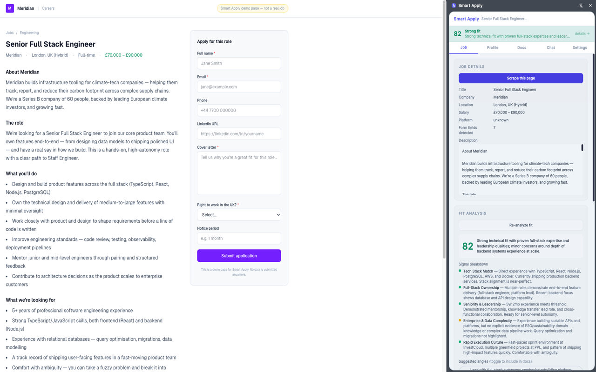

# Smart Apply

> AI-assisted job applications that actually fit the role — without the spray-and-pray.



Smart Apply is an open-source Chrome extension that sits alongside any job posting. It scrapes the role, analyses your fit, and writes a tailored CV and cover letter — then keeps you in the loop before anything goes out.

**Not a bot. Not a blank page. Something better.**

---

## How it works

1. **Scrape** — open any job posting and click Scrape. Smart Apply reads the page and extracts the title, company, location, salary, and description.
2. **Analyse fit** — get an honest 0–100 fit score with a signal breakdown, green flags, red flags, and suggested angles to lean into.
3. **Generate** — one click produces a tailored CV and cover letter, kept to 1–2 pages, grouped by company, no filler.
4. **Refine** — chat with the AI to rewrite bullets, adjust tone, or cut sections. Changes flow back into your documents live.
5. **Apply** — export to PDF, copy to clipboard, or let Smart Apply fill the application form fields directly from your profile.

---

## Features

| Feature | Detail |
|---|---|
| **Works everywhere** | LinkedIn, Greenhouse, Lever, Workday, Amazon Jobs, and any other job site |
| **Fit score** | 0–100 with signal breakdown, green/red flags, suggested angles |
| **Tailored CV + cover letter** | 1–2 pages, grouped by employer, no objectives section, no fluff |
| **Chat refinement** | Natural language edits that update your documents live |
| **Form fill** | AI maps your profile into application form fields automatically |
| **PDF export** | Direct download, auto-named `surname-company-cv.pdf` |
| **Document history** | Paginated history of all generated CVs and cover letters |
| **Multi-provider** | Anthropic, OpenAI, Gemini, Groq, OpenRouter, or any custom OpenAI-compatible endpoint |
| **100% private** | Everything lives in IndexedDB on your machine. Nothing touches our servers. |

---

## Privacy

Smart Apply has no server, no account, and no telemetry.

- Your profile, documents, and job history are stored locally in **IndexedDB** (via Dexie.js)
- Your API key is stored in **`chrome.storage.local`**
- The only external calls go directly from your browser to whichever AI provider you configure
- See the full [Privacy Policy](https://smartapply.dev/privacy)

---

## Setup

### 1. Get an API key

Smart Apply works with any of these providers — pick one:

| Provider | Get a key | Cost |
|---|---|---|
| **Anthropic** (recommended) | [console.anthropic.com](https://console.anthropic.com/settings/keys) | ~$0.05 per application |
| **OpenAI** | [platform.openai.com](https://platform.openai.com/api-keys) | ~$0.05 per application |
| **Gemini** | [aistudio.google.com](https://aistudio.google.com/apikey) | Free tier available |
| **Groq** | [console.groq.com](https://console.groq.com/keys) | Free tier available |
| **OpenRouter** | [openrouter.ai](https://openrouter.ai/keys) | Pay per use |

New Anthropic accounts receive free credits sufficient to test all features.

### 2. Install the extension

**From the Chrome Web Store** *(coming soon)*

**Or load unpacked (for development):**

```bash
git clone https://github.com/mhufton/smart-apply.git
cd smart-apply
npm install
npm run build
```

Then in Chrome: go to `chrome://extensions`, enable Developer Mode, click **Load unpacked**, and select the `dist/` folder.

### 3. Configure

Click the Smart Apply icon in your toolbar → **Settings** tab → select your provider and paste your API key.

---

## Usage

1. Navigate to any job posting
2. Click the **Smart Apply** toolbar icon to open the side panel
3. **Job tab** → click **Scrape this page**
4. Review the extracted job details, then click **Analyse Fit**
5. Review your fit score and signals, then click **Generate**
6. Your tailored CV and cover letter appear in the **Docs tab**
7. Refine via **Chat**, export to **PDF**, or click **Fill form** to inject your details into the application form

### Demo page

Try the extension on our [demo job posting](https://smartapply.dev/demo) — a realistic Senior Full Stack Engineer role with a full application form. No data is submitted anywhere.

---

## Tech stack

- **Vite** + **CRXJS** (`@crxjs/vite-plugin`) — Chrome extension bundling
- **React 18** + **TypeScript** — panel UI
- **Tailwind CSS 3** — styling
- **Dexie.js** — IndexedDB wrapper for local storage
- **jsPDF** — client-side PDF generation
- **Chrome Side Panel API** — 1/3-width panel alongside the page

---

## Project structure

```
src/
  background/     # Service worker — toolbar click, LinkedIn injection
  content/        # Content script — job scraping, form field detection
  panel/
    tabs/         # JobTab, ProfileTab, DocumentsTab, ChatTab, SettingsTab
    lib/          # claude.ts (API + prompts), storage.ts, db.ts, markdown.ts
    components/   # Shared UI components
  types/          # Shared TypeScript types
manifest.json
website/          # Next.js marketing site (app router, static)
```

---

## Development

```bash
npm install
npm run dev      # Vite dev server (load dist/ as unpacked extension)
npm run build    # Production build → dist/
```

After each build, go to `chrome://extensions` and click the refresh icon on Smart Apply.

---

## Contributing

Issues and PRs are welcome. This is a work in progress — expect rough edges.

- Report bugs or suggest features on [GitHub Issues](https://github.com/mhufton/smart-apply/issues)
- General enquiries: [contact@nerdlabsltd.com](mailto:contact@nerdlabsltd.com)

---

## Licence

MIT — see [LICENSE](LICENSE)

© 2026 [Nerd Labs Ltd](https://nerdlabsltd.com)
